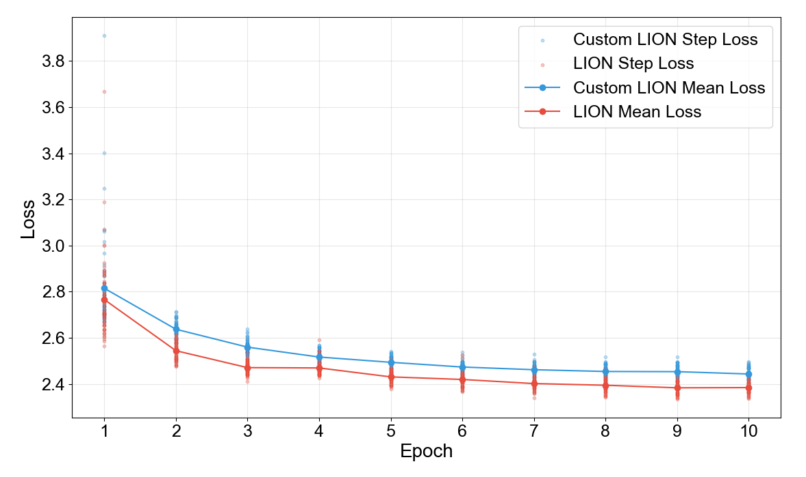
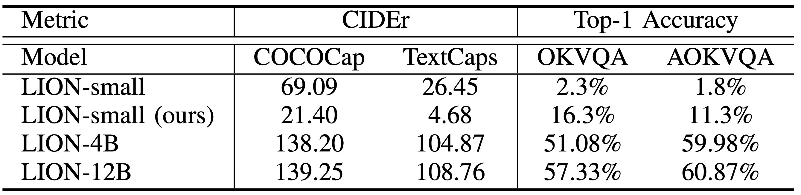
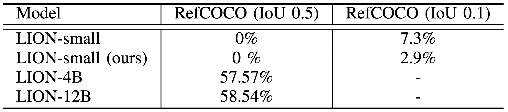

# Dynamic_LION

> [!NOTE]
> This repository is a **fork** of [PK-YOLO](https://github.com/mkang315/PK-YOLO) [[1]](#1) with some modifications.
> Original credits and license are preserved. We are not affiliated with the authors.
> We appreciate the original authors' work.

## Installation

```bash
conda create -n <env-name> python=3.12.4
conda activate <env-name>
pip-compile --output-file=requirements.txt requirements.in
pip install -r requirements.txt
```

## Result

### Training Result


Training result of LIONs, the original LION and the custom LION.
Original LION shows better loss convergence, but have the same learning curve with the custom LION.
Loss curves are average losses of step loss for each epoch.

### Experimental Result

<table>
    <tr>
        <td>
            
            Comparison of image captioning and VQA performance 
        </td>
        <td>
            
            Comparison of REC (Referring Expression Comprehension) on the RefCOCO
        </td>
    </tr>
</table>

## Reference

<a id="1" href="">[1]</a>
Chen, G., Shen, L., Shao, R., Deng, X., & Nie, L. "Lion: Empowering multimodal large language model with dual-level visual knowledge", in
<i>Proceedings of the IEEE/CVF Conference on Computer Vision and Pattern Recognition</i> (pp. 26540-26550).
